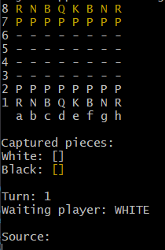

# Chess System Java



This project implements a chess system in Java, allowing users to simulate chess games with a simple graphical interface.

## Features

- Complete chessboard representation
- Piece movement validation according to chess rules
- Game management (start, play, and end)
- Graphical interface for gameplay interaction

## Installation

1. Clone the repository:
    ```bash
    git clone https://github.com/Taimisson/Chess-System-Java.git
    ```
2. Open the project in your preferred Java IDE.
3. Build the project to resolve dependencies.

## Usage

1. Run the main class to start the application.
2. Use the graphical interface to interact with the chessboard and play the game.

## Contributing

Contributions are welcome! Feel free to open issues or submit pull requests.

## License

This project is licensed under the MIT License. See the LICENSE file for details.
